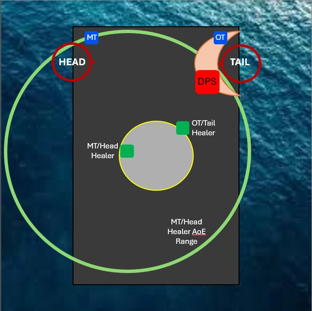

>Written By: Nienna Wynstone@Kraken

It is important to note that much of this fight is health percentage based and you may skip steps if your party has very high DPS.

## Abilities

**Body Slam**- Leviathan disappears and a geyser (water spout) will appear in the water at one end of the arena. This indicates that Leviathan will be jumping out of the water and slamming down on the platform, causing it to tip in that direction. Players must run to the opposite end of the arena, away from the geyser to prevent being knocked off into the water.

**Spinning Dive**- Leviathan disappears and a geyser will appear somewhere outside of the arena. He will then dash across the platform starting from where the geyser is located. For this he can dash the length OR width of the platform. Players must move away from the geyser, out of the path of the dive or they will take damage and potentially be knocked off into the water.

**Tidal Roar**- Raid-wide damage that occurs with every 10% of lost health

**Tsunami**- Heavy raid-wide damage

**Whirlpool**- Point-blank AoE targeting each healer, will deal damage to anyone caught in it so healers will need to stay spread from one another and the DPS should avoid standing near either healer.

**Grand Fall**- Waterbomb AoEs that appear on the farthest 2 players from the centre of the arena each time Leviathan disappears. Having party members move near the edges of the platform when Tidal Roar occurs will help to bait these out of the way for dodging the upcoming dives.

## Phase 1

We start by attacking Leviathan at the end of the arena until he hits 10% health. At this point he will disappear and perform a ***Body Slam*** and then split into head and tail. He has the ***Veil of the Whorl*** condition, indicating that the head will reflect physical ranged damage back at the player and the tail reflects magical damage. Melee damage is not reflected.

The main tank should grab the head and stand in the corner because it casts ***Dread Tide***, a high damage column AoE that can can kill other party members if directed towards the centre of the platform. The head also does ***Aquabreath***, a large AoE attack on the primary target that does low damage.

The off tank should grab the tail which casts ***Scale Darts*** on it’s target, a cleave that can be shared with the 4 DPS to reduce damage taken. Additionally, the off tank will be given ***Briny Mirror***, meaning that any direct heals they receive (single target or AoE) will put a debuff on the healer targeting them. The ***Briny Veil*** debuff reduces healing output and range with each stack so only one healer should be targeting the off tank at a time and the healers should switch around 5-6 stacks to prevent significant healing reduction. At 16 stacks, the healer will be stunned. Because of this debuff, we have the off tank stand in the corner with the 4 DPS stacked on the other end of the tail’s hitbox. If the head/main tank healer is positioned far enough away, this means that the cleave will still be shared between the tank and the DPS but that only the DPS will be hit with that healer’s AoE. This allows both healers to heal the DPS without getting stacks from hitting the off tank. Below is a rough diagram for party positioning.

Two melee ***Wavespine Sahagins*** will spawn at the North end of the arena and should be grabbed by the off tank and brought towards the tail. These need to be DPS’d down as quickly as possible. One mage ***Wavetooth Sahagin*** will spawn on the East and again will need to be DPS’d down as quickly as possible. If allowed to cast, this add will fear everyone in range and then drop a hysteria puddle. To prevent this, we have 1 melee DPS stun the add when it reaches 85-80% health and the off tank or another melee stun as soon as the first stun expires.

Next, four ***Gyre Spumes*** will spawn around the arena, one in each corner. This is a DPS check, if the spumes are left alive too long they will weaken the ***Elemental Converter*** and it will not provide enough protection during the Leviathan’s Ultimate attack, wiping the party. We start with the Spume at Leviathan’s tail and work our way around in a circle, killing the head Spume last. Off tank can move with the group around the arena but main tank must stay in their corner and can work on the Spume near them while waiting for the rest of the party to kill the other Spumes. Each Spume does raid-wide damage when it dies so it’s best to focus one down at a time.

Once the Spumes are dead, Leviathan can do 1 of 2 things depending on his health at the time. If he is 60% health or below, he will do one ***Spinning Dive***  lengthwise across the arena and then go into his Ultimate attack. In this case, as soon as you move out of the path of his dive, one player will need to interact with the ***Elemental Converter***. If however Levithan is above 60% health, he will do 2 ***Spinning Dives*** followed by a ***Body Slam*** and return to the arena until he reaches 60% health, after which he will do the dive into ultimate mentioned above that requires the converter to be activated. The best place to stand when he is doing the dives/body slam combo is in the middle circle because this gives you the least distance to move to avoid his dives regardless of which direction he comes from.

## Phase 2

In Phase 2, the railings break and players can now be knocked off into the water which is an instant death. He starts the phase off with a ***Body Slam*** so be sure to run away from the geyser that appears at one end of the arena or you will get tipped off into the sea.

Two ***Wavespine Sahagin*** will spawn and again, should be grabbed by the off tank and DPS’d down quickly. This will be followed by another combination of 2 ***Spinning Dives*** followed by a ***Body Slam***.

Four ***Gyre Spumes*** will appear again that can be killed in the same order as in phase 1. Additionally, 4 blue ***Wave Spume*** orbs will spawn around the arena and start moving toward the centre. These should not be attacked and they will explode after some time, doing high damage. When these spawn, the off tank will need to go centre and intersect all of them and pull them away from the party. Once away from the party, they will need to use their invuln to survive the explosions.

Depending on DPS, there may be another set of 2 ***Spinning Dives*** followed by a ***Body Slam*** while you are working on killing the final ***Gyre Spume*** so be ready to dodge while also avoiding the off tank and their orbs.

Once Leviathan is below 20% health, he will do one ***Spinning Dive*** lengthwise across the arena signalling that it’s time to activate the ***Elemental Converter*** again for protection from his Ultimate attack.

## Phase 3

In Phase 3, you will need to deal with another mage ***Wavetooth Sahagin*** that will need to be stunned consecutively and DPS’d down quickly. Leviathan may do one last combination of 2 ***Spinning Dives*** followed by a ***Body Slam*** depending on damage level and then will go into his hard enrage ***Tsunami*** cast if not killed fast enough. **Good Luck!**
<!--stackedit_data:
eyJoaXN0b3J5IjpbLTgxODk4ODkzOCwtMTU2MzA1MzUxNCwtMT
M3NjUyMjg5LDEzNjg4MTk4MzRdfQ==
-->